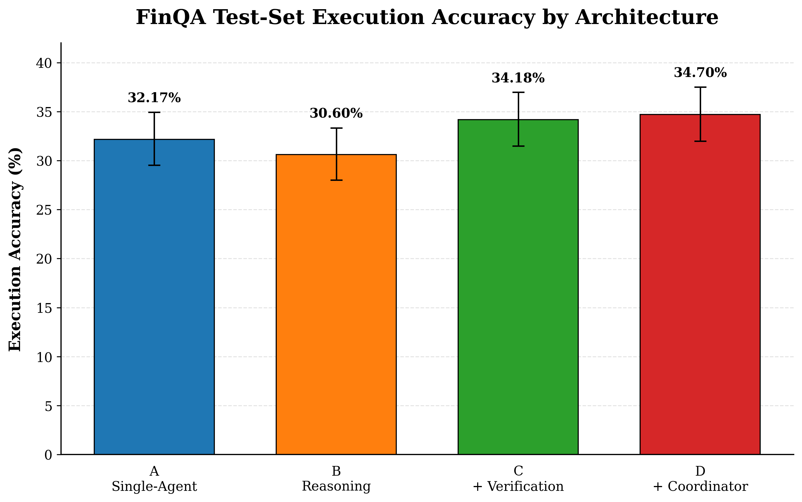
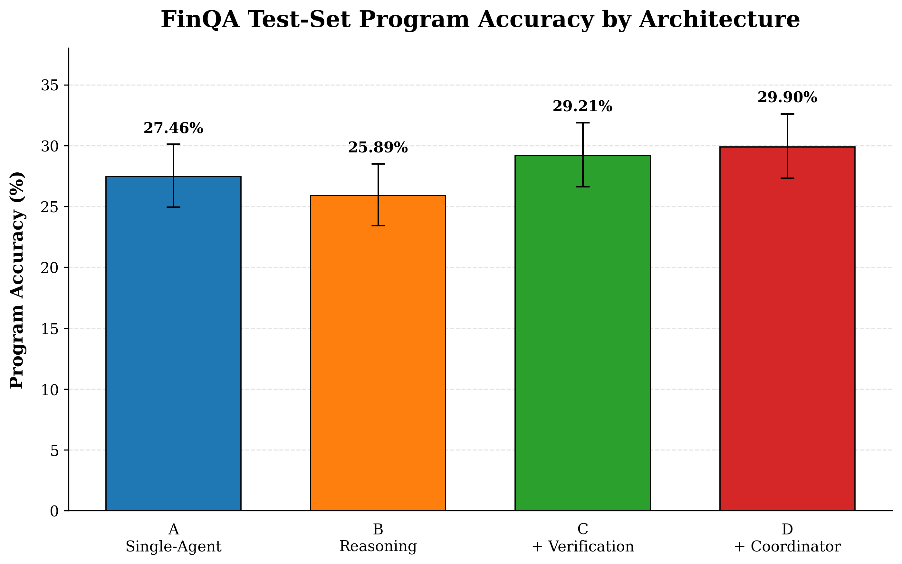
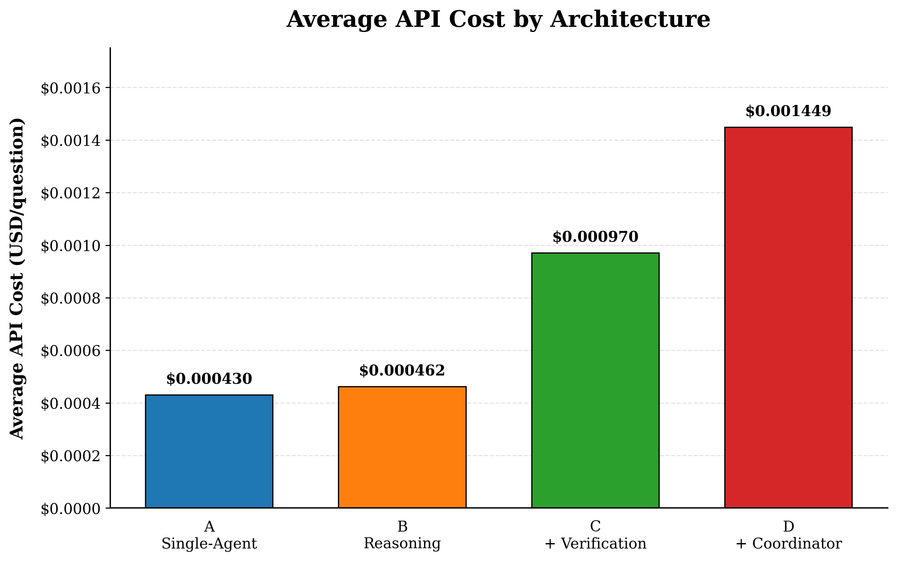
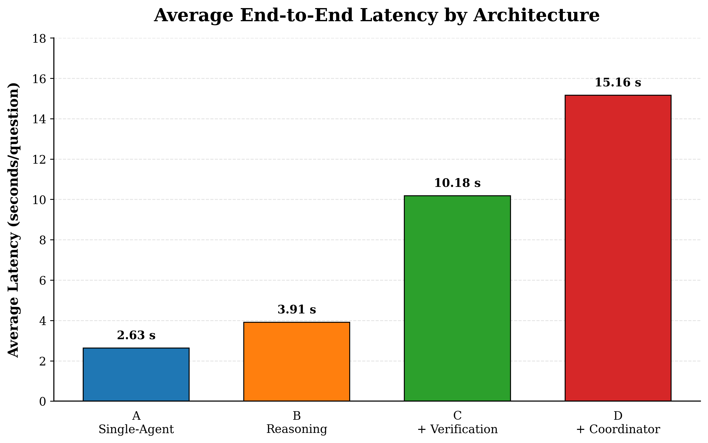
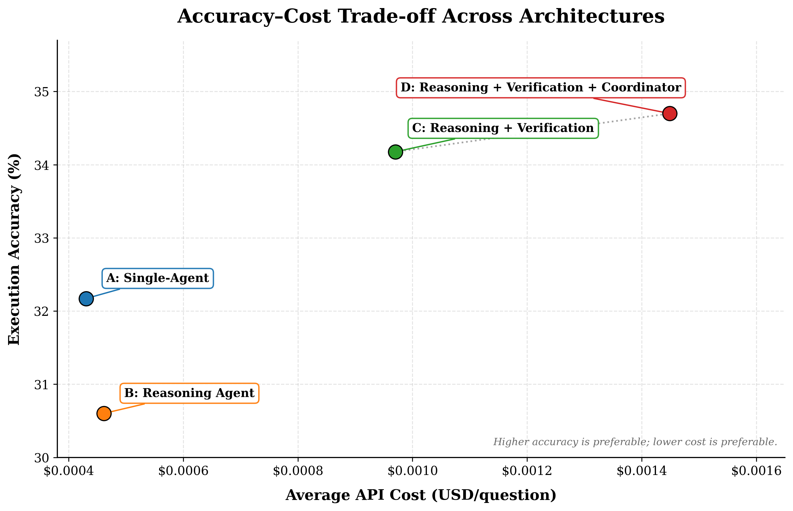

# Comparative Evaluation of Multi-Agent and Single-Agent LLM Systems for Business Decision Support

## MSc Master Thesis

This repository contains the implementation, experiments, evaluation pipeline,
statistical analysis, reliability analysis, error analysis, and reproducibility
materials for the MSc dissertation:

**Comparative Evaluation of Multi-Agent and Single-Agent LLM Systems for Business Decision Support**

**Programme:** MSc Data Science, Artificial Intelligence & Digital Business  
**University:** GISMA University of Applied Sciences, Potsdam ,Germany   
**Authors:** Rohan Dharmendra and Karthik Kumar Honnapura Umashankar  
**Supervisor:** Dr. Loui Al Sardy  

---

# 1. Project Overview

Large Language Models are increasingly being extended from simple single-agent
systems into multi-agent architectures containing specialised reasoning,
verification, and coordination stages.

However, additional agents also introduce:

- greater latency
- higher token usage
- increased API cost
- additional opportunities for error

This dissertation performs a controlled empirical comparison of four staged LLM
architectures using the **FinQA financial numerical reasoning benchmark**.

The primary experimental variable is:

**Agent Architecture**

The underlying LLM, dataset, financial evidence, few-shot demonstrations,
generation settings, validator, executor, and evaluation metrics are kept fixed
as far as architecturally possible.

The experiment therefore investigates whether increasing architectural
complexity actually improves financial numerical reasoning and decision-support
performance.

---

# 2. Research Questions

## RQ1 — Reasoning Performance

How does agent architecture affect reasoning performance, measured using:

- FinQA execution accuracy
- FinQA program accuracy

---

## RQ2 — Reliability

How reliable are single-agent and multi-agent architectures across repeated
runs?

Reliability is evaluated using:

- repeated-run accuracy
- execution consistency
- correctness flips
- exact generated-program agreement
- validation failures
- execution failures
- parsing/API failures

---

## RQ3 — Efficiency

What efficiency trade-offs arise as architectural complexity increases?

Metrics include:

- end-to-end latency
- input tokens
- output tokens
- API cost

---

## RQ4 — Component Contribution

What contribution is made by:

- explicit reasoning
- independent verification
- coordination

to overall system performance?

---

# 3. Experimental Design

Four staged configurations are evaluated:

| Configuration | Architecture | Added Component | LLM Calls / Question |
|---|---|---|---:|
| A | Single-Agent | Direct program generation | 1 |
| B | Reasoning Agent | Explicit reasoning plan | 1 |
| C | Reasoning + Verification | Independent verification | 2 |
| D | Reasoning + Verification + Coordinator | Final coordination | 3 |

The staged comparison follows:

```text
A  ->  B  ->  C  ->  D
     +      +      +
  Reason  Verify  Coordinate
```

This structure allows each additional architectural component to be evaluated
incrementally.

---

# 4. Configuration A — Single-Agent

Configuration A is the simplest architecture.

A single LLM directly generates a FinQA program from the question and financial
evidence.

```text
Question + Financial Evidence
            |
            v
       Single Agent
            |
            v
       FinQA Program
            |
            v
Validator -> Executor -> Evaluator
```

**Implementation:**  
[`agents/configuration_a.py`](agents/configuration_a.py)

**LLM calls per question:** 1

Structured output:

```json
{
  "program": "..."
}
```

The generated FinQA program is evaluated using:

- execution accuracy
- program accuracy

Configuration A serves as the direct single-agent baseline.

---

# 5. Configuration B — Reasoning Agent

Configuration B introduces an explicit reasoning stage.

The model first produces a short reasoning plan and then generates the FinQA
program.

```text
Question + Financial Evidence
            |
            v
      Reasoning Agent
            |
            v
       Plan + Program
            |
            v
Validator -> Executor -> Evaluator
```

**Implementation:**  
[`agents/configuration_b.py`](agents/configuration_b.py)

**LLM calls per question:** 1

Structured output contains:

```text
plan
program
```

The reasoning plan is used internally to guide generation.

The plan itself is **not scored**.

Only the generated FinQA program is evaluated using execution accuracy and
program accuracy.

Configuration B tests whether explicit planning improves performance compared
with direct single-agent generation.

---

# 6. Configuration C — Reasoning + Verification

Configuration C extends Configuration B by adding a second verification agent.

The Reasoning Agent first generates a candidate FinQA program.

A Verification Agent then receives the original problem and independently
derives its own solution before comparing it with the candidate.

```text
Question + Financial Evidence
            |
            v
      Reasoning Agent
            |
            v
      Candidate Program
            |
            v
    Verification Agent
            |
            v
       Final Program
            |
            v
Validator -> Executor -> Evaluator
```

**Implementation:**  
[`agents/configuration_c.py`](agents/configuration_c.py)

**LLM calls per question:** 2

The Verification Agent receives:

- original question
- original financial evidence
- fixed few-shot demonstrations
- candidate program

The verifier does **not** receive the Reasoning Agent's reasoning plan.

The verifier is instructed to independently solve the task before comparing
its solution against the candidate.

Structured verifier output includes:

```text
independent_plan
independent_program
candidate_verdict
final_program
```

Configuration C tests whether independently instructed verification can detect
and correct errors produced by the reasoning stage.

---

# 7. Configuration D — Reasoning + Verification + Coordinator

Configuration D is the most complex architecture evaluated.

It extends Configuration C by adding a final Coordinator Agent.

```text
Question + Financial Evidence
            |
            v
      Reasoning Agent
            |
            v
      Candidate Program
            |
            v
    Verification Agent
            |
            v
      Verified Output
            |
            v
        Coordinator
            |
            v
       Final Program
            |
            v
Validator -> Executor -> Evaluator
```

**Implementation:**  
[`agents/configuration_d.py`](agents/configuration_d.py)

**LLM calls per question:** 3

The Coordinator receives:

- original question
- original financial evidence
- reasoning-agent candidate
- verification output
- verifier verdict

The Coordinator then determines the final FinQA program.

Configuration D evaluates whether a final coordination stage provides additional
benefit beyond verification.

---

# 8. Shared Language Model

All architectures use the same underlying model:

```text
qwen/qwen3-30b-a3b-instruct-2507
```

Provider:

```text
OpenRouter
```

Generation settings:

```text
Temperature: 0
Maximum output tokens: 400
```

The same underlying model is used for all configurations so that model choice is
not the main experimental variable.

Role-specific prompts and structured-output schemas differ only where required
by each architectural role.

---

# 9. Dataset

The experiments use the **FinQA** benchmark.

FinQA is designed for numerical reasoning over financial reports.

Local dataset files:

```text
data/finqa/train.json
data/finqa/dev.json
data/finqa/test.json
```

Dataset usage:

| Split | Purpose |
|---|---|
| Train | Fixed few-shot demonstrations |
| Dev | Development and reliability experiments |
| Test | Frozen final evaluation |

The final evaluation uses:

**1,147 FinQA test questions**

### FinQA Reference

Chen et al. (2021),  
**FinQA: A Dataset of Numerical Reasoning over Financial Data**

Paper:

https://aclanthology.org/2021.emnlp-main.300/

Official FinQA repository:

https://github.com/czyssrs/FinQA

---

# 10. Fixed Few-Shot Demonstrations

Four fixed FinQA training demonstrations are used across the experiment.

The demonstrations are defined in:

[`single_agent/few_shot.py`](single_agent/few_shot.py)

They were frozen before the final evaluation and were not modified between
architectures.

---

# 11. Evaluation Pipeline

Generated programs are evaluated through a deterministic evaluation pipeline.

```text
LLM Output
    |
    v
Program Validator
    |
    v
Program Executor
    |
    v
Program Evaluator
    |
    v
Execution Accuracy / Program Accuracy
```

Main evaluation components:

- [`evaluation/finqa_validator.py`](evaluation/finqa_validator.py)
- [`evaluation/finqa_executor.py`](evaluation/finqa_executor.py)
- [`evaluation/finqa_program_evaluator.py`](evaluation/finqa_program_evaluator.py)
- [`evaluation/evaluate_answers.py`](evaluation/evaluate_answers.py)

Gold FinQA answers and programs are accessed only after generation during
evaluation.

---

# 12. Final FinQA Test Results

The final frozen experiment evaluates all:

**1,147 FinQA test questions**

| Configuration | Architecture | Execution Accuracy | Program Accuracy | Mean Latency | Cost / Question |
|---|---|---:|---:|---:|---:|
| A | Single-Agent | 32.17% | 27.46% | 2.63 s | $0.000430 |
| B | Reasoning Agent | 30.60% | 25.89% | 3.91 s | $0.000462 |
| C | Reasoning + Verification | 34.18% | 29.21% | 10.18 s | $0.000970 |
| D | Reasoning + Verification + Coordinator | **34.70%** | **29.90%** | 15.16 s | $0.001449 |

Execution-correct counts:

```text
A = 369 / 1147
B = 351 / 1147
C = 392 / 1147
D = 398 / 1147
```

---

# 13. Execution Accuracy



Configuration D achieved the highest raw execution accuracy at **34.70%**,
followed closely by Configuration C at **34.18%**.

---

# 14. Program Accuracy



Configuration D achieved the highest program accuracy at **29.90%**, while
Configuration C achieved **29.21%**.

---

# 15. Efficiency

## Average API Cost



Increasing architecture complexity substantially increased API cost.

Approximate average cost per question:

```text
A: $0.000430
B: $0.000462
C: $0.000970
D: $0.001449
```

---

## Average Latency



Average latency increased with each additional agent stage:

```text
A:  2.63 seconds
B:  3.91 seconds
C: 10.18 seconds
D: 15.16 seconds
```

---

# 16. Accuracy–Cost Trade-off



Configuration D achieved the highest raw accuracy.

However, Configuration C achieved nearly the same performance with considerably
lower latency and cost.

This indicates diminishing returns from the additional Coordinator stage.

---

# 17. Sequential Ablation Analysis

The staged architecture allows each component to be analysed separately.

## A → B: Explicit Reasoning

Execution accuracy change:

```text
-1.57 percentage points
```

Program accuracy change:

```text
-1.57 percentage points
```

Interpretation:

Explicit reasoning alone did not improve performance relative to direct
single-agent generation.

---

## B → C: Independent Verification

Execution accuracy change:

```text
+3.57 percentage points
```

Program accuracy change:

```text
+3.31 percentage points
```

Interpretation:

Independent verification produced the largest positive architectural
contribution.

---

## C → D: Coordinator

Execution accuracy change:

```text
+0.52 percentage points
```

Program accuracy change:

```text
+0.70 percentage points
```

Interpretation:

The Coordinator produced a smaller additional gain while increasing both
latency and API cost.

---

# 18. Statistical Analysis

Final statistical analysis is implemented in:

[`evaluation/analyze_final_test.py`](evaluation/analyze_final_test.py)

The analysis includes:

- question-level paired architecture comparisons
- exact two-sided McNemar tests
- Holm multiple-comparison correction
- Wilson 95% confidence intervals
- paired difference confidence intervals
- sequential architecture ablation

Important findings:

| Comparison | Execution Difference | Holm-Adjusted Result |
|---|---:|---|
| A vs B | -1.57 pp | Not significant |
| A vs C | +2.01 pp | Not significant |
| A vs D | +2.53 pp | Not significant after correction |
| B vs C | +3.57 pp | Significant |
| B vs D | +4.10 pp | Significant |
| C vs D | +0.52 pp | Not significant |

The most important result is that the additional Coordinator stage in
Configuration D did not produce a statistically significant improvement over
Configuration C.

Therefore, the highest raw accuracy does not automatically imply the most
efficient or practically preferable architecture.

---

# 19. Reliability Analysis

Reliability was evaluated using three repeated runs on the same fixed
development subset:

```text
dev[75:175]
```

This corresponds to:

**100 FinQA development questions**

Reliability analysis is implemented in:

[`evaluation/evaluate_reliability.py`](evaluation/evaluate_reliability.py)

Exact generated-program agreement:

| Configuration | Program Agreement |
|---|---:|
| A | 84% |
| B | 83% |
| C | 80% |
| D | 77% |

An important finding is that increasing architectural complexity did **not**
increase exact output determinism.

Even with:

```text
temperature = 0
```

hosted LLM inference was not completely deterministic.

---

# 20. Component-Level Error Correction

## Configuration C — Verification

The verifier:

```text
Corrected reasoning errors: 56
Broke correct reasoning outputs: 9
Net correction effect: +47
```

This makes independent verification the strongest beneficial additional
component in the experiment.

---

## Configuration D — Coordinator

The Coordinator:

```text
Corrected verifier errors: 10
Broke verified correct outputs: 1
Net correction effect: +9
```

The Coordinator was beneficial overall, but its contribution was considerably
smaller than the Verification Agent's contribution.

---

# 21. Error Analysis

Error analysis is implemented in:

[`evaluation/analyze_errors.py`](evaluation/analyze_errors.py)

The dominant failure category was:

```text
Executable but incorrect answer
```

This means most failures were primarily caused by semantic or numerical
reasoning errors rather than API failures or output-format errors.

Observed error types included:

- incorrect percentage scaling
- wrong financial evidence selection
- numerator/denominator reversal
- incorrect subtraction direction
- wrong arithmetic operator
- incomplete aggregation
- unnecessary unit conversion
- incorrect percentage reconstruction
- multi-step reference errors
- averaging mistakes
- invalid FinQA operation syntax
- shared reasoning failures across agents

One important conclusion is:

> **Agent agreement does not necessarily imply correctness.**

Because the agents use the same underlying LLM, several agents can converge on
the same incorrect interpretation.

---

# 22. Project Structure

```text
Master-Thesis/
│
├── agents/
│   ├── __init__.py
│   ├── common.py
│   ├── configuration_a.py
│   ├── configuration_b.py
│   ├── configuration_c.py
│   └── configuration_d.py
│
├── data/
│   └── finqa/
│       ├── train.json
│       ├── dev.json
│       └── test.json
│
├── evaluation/
│   ├── analyze_errors.py
│   ├── analyze_final_test.py
│   ├── compare_architectures.py
│   ├── evaluate_answers.py
│   ├── evaluate_reliability.py
│   ├── export_thesis_results.py
│   ├── finqa_executor.py
│   ├── finqa_program_evaluator.py
│   ├── finqa_validator.py
│   ├── test_finqa_modules.py
│   └── test_finqa_program_evaluator.py
│
├── single_agent/
│   ├── baseline.py
│   └── few_shot.py
│
├── multi_agent/
│   └── baseline.py
│
├── results/
│   ├── final experiment outputs
│   ├── reliability results
│   ├── statistical analysis
│   ├── error analysis
│   └── thesis_exports/
│
├── README.md
├── requirements-lock.txt
└── .gitignore
```

Important:

The final A/B/C/D architecture implementations are located under:

```text
agents/
```

`multi_agent/baseline.py` represents an earlier prototype and is not the final
multi-agent architecture used for the reported experiment.

---

# 23. Installation

Clone the repository:

```bash
git clone https://github.com/rohangowda2926/Master-Thesis-.git
cd Master-Thesis-
```

Create a Python virtual environment:

```bash
python -m venv .venv
```

Activate on Windows:

```powershell
.venv\Scripts\Activate.ps1
```

Install dependencies:

```bash
python -m pip install -r requirements-lock.txt
```

---

# 24. Environment Variables

Create a local `.env` file:

```text
OPENROUTER_API_KEY=your_openrouter_api_key
```

Do not commit `.env`.

---

# 25. Running the Architectures

## Configuration A

```bash
python -m agents.configuration_a --split test --start 0 --count 1147
```

## Configuration B

```bash
python -m agents.configuration_b --split test --start 0 --count 1147
```

## Configuration C

```bash
python -m agents.configuration_c --split test --start 0 --count 1147
```

## Configuration D

```bash
python -m agents.configuration_d --split test --start 0 --count 1147
```

The result files included in this repository represent the **frozen final thesis
experiments**.

They should not be rerun simply to obtain different results.

---

# 26. Running Unit Tests

Run:

```bash
python -m unittest evaluation.test_finqa_program_evaluator evaluation.test_finqa_modules -v
```

Expected result:

```text
Ran 18 tests
OK
```

---

# 27. Statistical Analysis

Run:

```bash
python -m evaluation.analyze_final_test
```

This performs the paired final architecture analysis.

---

# 28. Error Analysis

Run:

```bash
python -m evaluation.analyze_errors
```

This generates:

- failure taxonomy
- question-level architecture patterns
- representative cases
- rescue/loss patterns
- verifier correction analysis
- coordinator correction analysis

---

# 29. Dissertation Figures and Tables

Generate the dissertation-ready figures and summary tables with:

```bash
python -m evaluation.export_thesis_results
```

This step performs:

```text
0 LLM API calls
```

Outputs are written to:

```text
results/thesis_exports/
```

including:

```text
thesis_execution_accuracy.png
thesis_program_accuracy.png
thesis_latency.png
thesis_cost.png
thesis_accuracy_cost_tradeoff.png

thesis_final_summary.csv
thesis_rq_summary.csv
thesis_statistical_summary.csv
```

---

# 30. Reproducibility

The experimental methodology was frozen before final test-set evaluation.

No changes were made during the final evaluation to:

- underlying model
- temperature
- maximum output tokens
- fixed few-shot demonstrations
- architecture definitions
- architecture prompts
- validator
- executor
- program evaluator
- final test examples
- evaluation metrics

The complete FinQA public test set was evaluated once for each final
architecture.

Repeated runs were performed separately on the fixed development subset for
reliability analysis.

---

# 31. Main Findings

The study produced four main findings.

### 1. More architecture does not automatically mean better performance

Configuration B performed worse than the simpler Configuration A.

Explicit reasoning alone therefore did not guarantee improved financial
numerical reasoning.

### 2. Verification was the strongest beneficial component

Configuration C substantially improved over Configuration B.

The verification stage corrected considerably more reasoning errors than it
introduced.

### 3. Coordination showed diminishing returns

Configuration D achieved the highest raw accuracy.

However, the improvement over Configuration C was small and not statistically
significant after multiple-comparison correction.

Configuration D also required substantially greater latency and API cost.

### 4. Multi-agent agreement does not guarantee correctness

Multiple agents using the same underlying LLM can converge on the same incorrect
reasoning path.

Therefore agent consensus should not automatically be interpreted as evidence of
correctness.

---

# 32. Security

The following files and information must never be committed:

```text
.env
API keys
OpenRouter credentials
GitHub personal access tokens
passwords
.venv/
```

The repository `.gitignore` excludes local credentials, virtual environments,
Python caches, and development-only files.

---

# 33. Academic Purpose

This repository contains research software developed as part of an MSc
dissertation.

The repository supports transparency and reproducibility of the experimental
work and should be interpreted together with the final dissertation.

---

# 34. Authors

**Rohan Dharmendra**  
**Karthik Kumar Honnapura Umashankar**

MSc Data Science, Artificial Intelligence & Digital Business  
GISMA University of Applied Sciences, Potsdam, Germany 

**Supervisor:** Dr. Loui Al Sardy

---

# 35. Repository

GitHub:

https://github.com/rohangowda2926/Master-Thesis-
